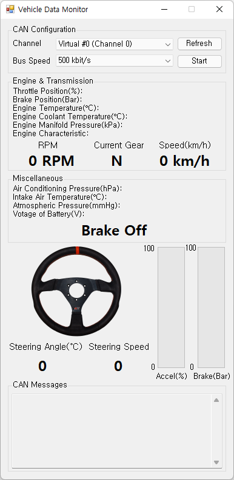
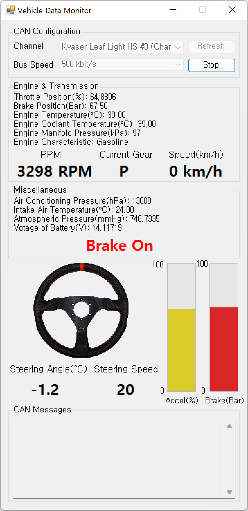
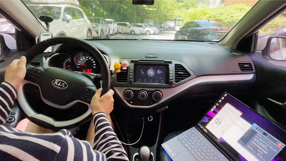

# vehicle-driving-monitor
monitoring various sensor signals(EMS, TCU, SAS, CLU an so on) while driving a vehicle

# Prerequisite
* Target DBC file(in my case, i used hyundai_kia_generic.dbc in [commai/opendbc][repo])
* Kvaser Leaf Light HS v2(or another kvaser CAN logger) & Kvaser [CanLib SDK][canlib_link]

## References
* CanLib Usage: https://www.kvaser.com/canlib-webhelp/page_canlib.html
* DBC specification: https://docs.openvehicles.com/en/latest/components/vehicle_dbc/docs/dbc-primer.html

[canlib_link]: https://www.kvaser.com/canlib-webhelp/section_install_windows.html
[repo]: https://github.com/commaai/opendbc
